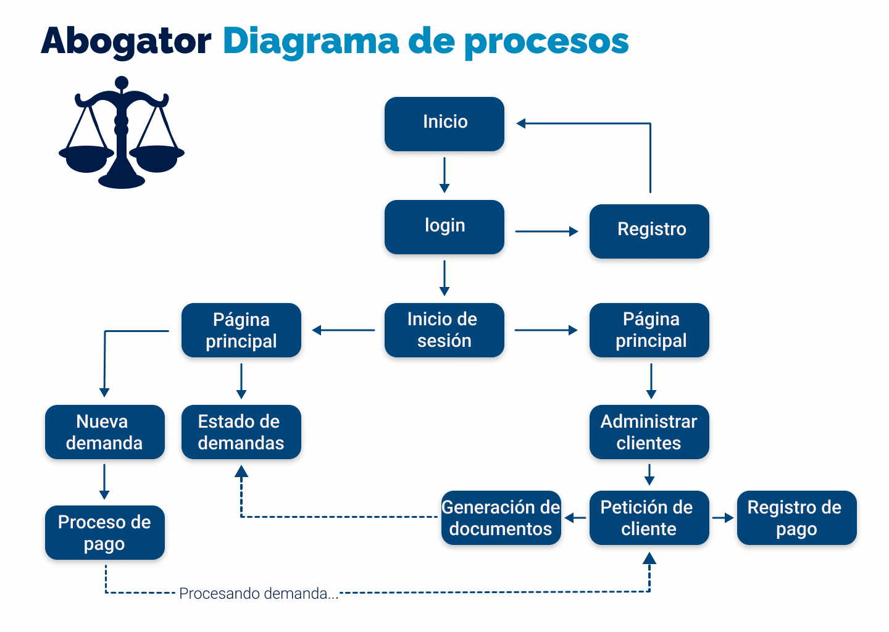
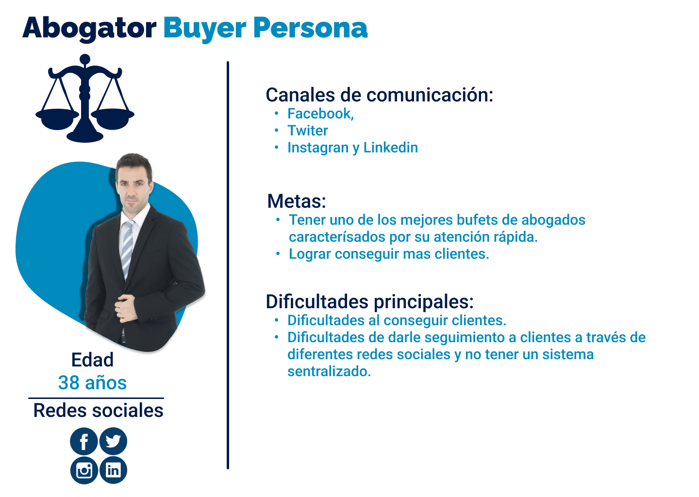
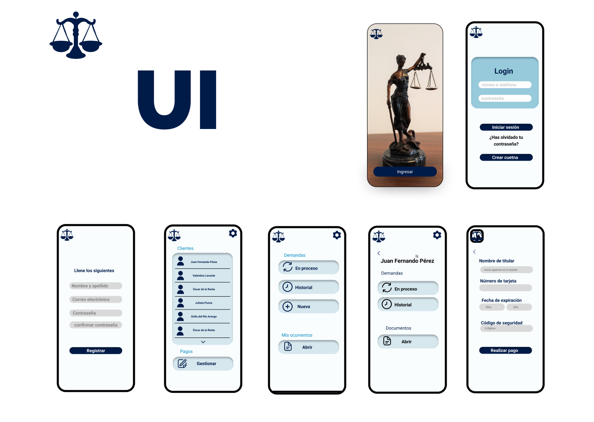

# MODULO - 1 🚀

 >## PRACTICA ABOGATOR 📖

- ### Toma de requerimientos ✅
     
---
- ### Buyer persona ✅
     
---
- ### Publico objetivo ✅
    
---
- ### Wireframe UX ✅
     
---
- ### UI ✅
     
---  
## [Regrgesar  ⬅️](/README.md)
